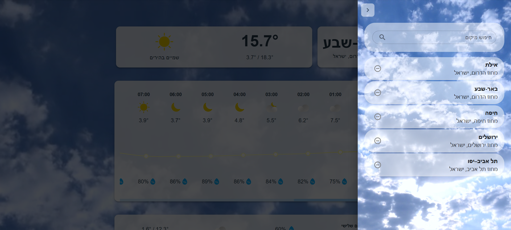

# Weather By City

## Table of Contents

1. [Project Overview](#project-overview)
2. [Website Flow](#website-flow)
3. [Directory Structure](#directory-structure)
4. [Technologies Used](#technologies-used)
5. [Setup and Installation](#setup-and-installation)
6. [Environment Variables](#environment-variables)


## Project Overview

This is a responsive website that provides detailed weather forecasts, including hourly weather for the current day, information about the day such as wind, humidity, sunrise and sunset times, as well as a 10-day forecast.


## Website Flow

### New User / No Saved Locations

If the user does not have any saved locations, they will be prompted to choose a location to get started.


### User with Saved Locations

If the user has at least one saved location, the detailed weather forecast will be displayed.


### Manage locations

A side menu for managing the user's locations, allowing the ability to search for locations, add new locations, and remove saved ones.




## Directory Structure

**`Back/`** directory:

- **`models/`**: Contains MongoDB schemas defining the data structure for the user. Each user has an array of saved locations.
- **`routes/`**:
  - Handles location search by user input using `LocationIQ`.
  - Manages saved locations (add, remove, retrieve).
  - Fetches detailed weather data for the selected location using `Open-Meteo`.
- **`middleware`/**: Middleware that checks for a user identifier cookie. If found, retrieves the user ID. If not found, creates a new cookie with a generated user ID and stores the user in the database.
- **`db.js`**: Handles the connection to the MongoDB database.
- **`index.js`**: The main entry point that sets up the Express server, initializes the database connection via db.js, and defines the application's routes.

**`Front/src/`** directory:

- **`assets/icons/`**: Contains the weather icons.
- **`components/`**: Components for the website.
- **`contexts/`**: Manages the current location context.
- **`services/`**: Contains functions for API communication with the server for location management.
- **`utils/`**: Contains a file that maps weather codes to icons.
- **`App.jsx`**: The main page of the website.
- **`main.jsx`**: The entry point of the React application.


## Technologies Used

The project leverages modern web development technologies to deliver a robust and efficient application. Here's a breakdown:

### Backend

- **Node.js**: Provides the server-side runtime environment.
- **Express.js**: Simplifies server-side routing and middleware management.
- **JavaScript**: Core language for implementing the backend logic.
- **Axios**: For making HTTP requests, particularly for interacting with the frontend.

### Frontend

- **React**: Used for building the dynamic and interactive user interface.
- **Vite**: A fast development server and build tool to enhance frontend performance.
- **Material-UI (MUI)**: A React-based UI library for pre-designed, customizable components.

### Third-Party APIs

- **Open-Meteo**: Fetches detailed weather data.
- **LocationIQ**: Fetches location data based on search input.

### Database

- **MongoDB**: A NoSQL database for storing users and their saved locations.


## Setup and Installation

### Backend Setup

1. Navigate to the backend directory:

   ```bash
   cd Back
   ```

2. Install dependencies:

   ```bash
   npm install
   ```

3. Start the server:

   To run the server, you can use either `node` or `nodemon`. Using `nodemon` will automatically restart the server whenever there are changes to the code.

   - To start the server with `node`:

     ```bash
     node index.js
     ```

   - To start the server with `nodemon` (recommended for development):

     First, install `nodemon` globally if you haven't already:

     ```bash
     npm install -g nodemon
     ```

     Then, run the server with `nodemon`:

     ```bash
     nodemon index.js
     ```

   **Note**: `nodemon` is particularly useful in development as it monitors changes in your files and automatically restarts the server, saving you from having to manually stop and start the server each time you make a change.

### Frontend Setup

1. Navigate to the frontend directory:

   ```bash
   cd Front
   ```

2. Install dependencies:

   ```bash
   npm install
   ```

3. Start the development server:

   ```bash
   npm run dev
   ```


## Environment Variables

To ensure the application functions correctly, create `.env` files in both the frontend and backend directories with the following keys:

### Backend `.env`

- `PORT`: The port number the server will run on.
- `MONGO_URI`: The connection string for the MongoDB database.
- `API_KEY`: The API key for `LocationIQ` to use their service.

### Frontend `.env`

- `VITE_API_BASE_URL`: The URL of the backend server (e.g., `http://localhost:3000`).
